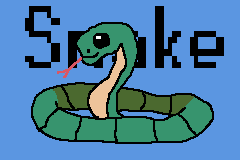

# AGB Snake



Basic game for **Gameboy Advance** written with AGB.

## Building

### Prerequisites

You will need the following installed in order to build and run this project:

- A recent version of `rustup`. See the [rust website](https://www.rust-lang.org/tools/install) for instructions for your operating system

You will also want to install [mgba](https://mgba.io) to run the game.

If you want to run your game on real hardware, you will also need to install `agb-gbafix` which you can do after installing
rust with the following: `cargo install agb-gbafix`. This is not required if you are only running your game in an emulator.

### Running in an emulator

```sh
cargo build && cargo run
```

### Credits

Background music: Area12 from Space Cat
